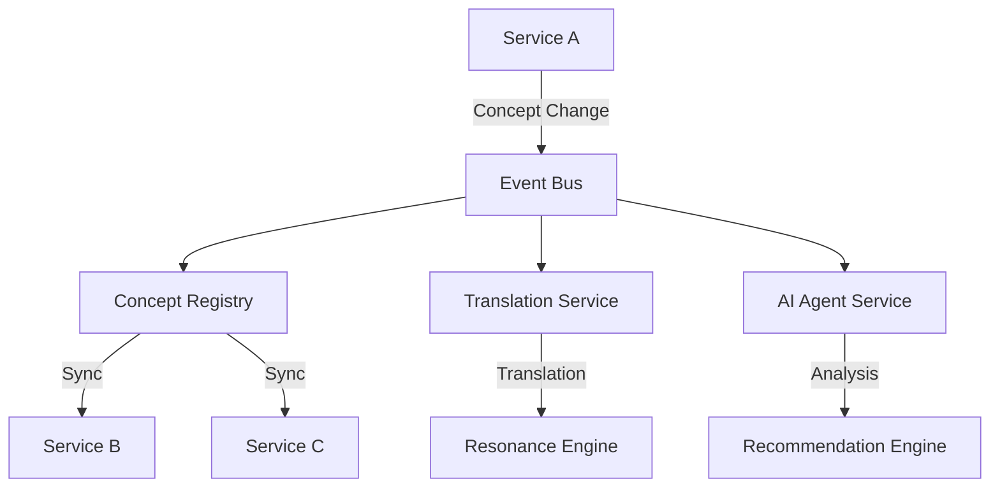
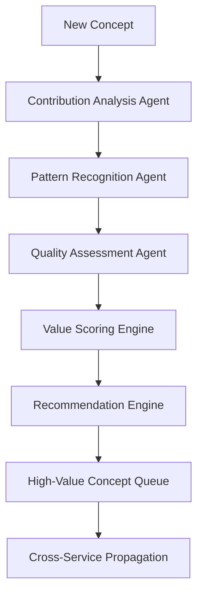

# Multi-Service Architecture Specification
## Living Codex C# - Distributed Concept Exchange System

### Overview
This specification outlines the architecture for hosting multiple Living Codex services that can exchange concepts, integrate changes, and leverage AI agents to identify high-value contributions that benefit the entire ecosystem.

## Core Architecture Principles

### 1. Everything is a Node
- **Data, structure, flow, state, deltas, policies, specs** — all have node forms
- **Runtime types are scaffolding** that must round-trip ⇄ nodes
- **Meta-Nodes describe structure** - schemas, APIs, layers, code expressed as nodes with edges

### 2. Distributed Service Mesh
- **Service Discovery**: Automatic discovery and registration of Living Codex services
- **Concept Synchronization**: Real-time concept exchange between services
- **Change Propagation**: Delta-based updates across the service mesh
- **Conflict Resolution**: Intelligent merging of concept changes

### 3. AI Agent Integration
- **Contribution Analysis**: AI agents analyze concept contributions for value
- **Pattern Recognition**: Identify emerging patterns and high-value concepts
- **Recommendation Engine**: Suggest concepts that would benefit most users
- **Quality Assessment**: Evaluate concept quality and relevance

## Service Architecture

### Core Services

#### 1. Concept Registry Service
```yaml
Service: concept-registry
Purpose: Central registry for all concepts across services
Responsibilities:
  - Concept registration and discovery
  - Version management and conflict resolution
  - Cross-service concept synchronization
  - Metadata and relationship management
```

#### 2. Translation Service
```yaml
Service: translation-service
Purpose: Multi-framework concept translation
Responsibilities:
  - Belief system translation
  - Cross-cultural concept adaptation
  - Language and framework conversion
  - Translation quality assessment
```

#### 3. Resonance Engine Service
```yaml
Service: resonance-engine
Purpose: Calculate concept resonance and unity
Responsibilities:
  - Resonance score calculation
  - Unity amplification metrics
  - Belief system alignment analysis
  - Cross-service resonance mapping
```

#### 4. AI Agent Service
```yaml
Service: ai-agent-service
Purpose: Intelligent concept analysis and recommendation
Responsibilities:
  - High-value contribution identification
  - Pattern recognition and trend analysis
  - User benefit optimization
  - Concept quality assessment
```

#### 5. Storage Service
```yaml
Service: storage-service
Purpose: Distributed concept storage and retrieval
Responsibilities:
  - Concept persistence across services
  - Delta storage and versioning
  - Cross-service data synchronization
  - Backup and recovery
```

### Service Communication

#### 1. Event-Driven Architecture
```csharp
// Concept change events
public record ConceptCreatedEvent(
    string ConceptId,
    string ServiceId,
    ConceptNode Concept,
    DateTime Timestamp
);

public record ConceptUpdatedEvent(
    string ConceptId,
    string ServiceId,
    ConceptDelta Delta,
    DateTime Timestamp
);

public record ConceptTranslatedEvent(
    string ConceptId,
    string SourceServiceId,
    string TargetServiceId,
    TranslationResult Translation,
    DateTime Timestamp
);
```

#### 2. API Gateway Pattern
```csharp
public class ConceptExchangeGateway
{
    public async Task<ConceptExchangeResponse> ExchangeConcept(
        string conceptId,
        string sourceServiceId,
        string targetServiceId,
        TranslationRequest request
    );
    
    public async Task<ContributionAnalysisResponse> AnalyzeContribution(
        string conceptId,
        string serviceId,
        ContributionAnalysisRequest request
    );
}
```

## AI Agent Integration

### 1. Contribution Analysis Agent
```csharp
public class ContributionAnalysisAgent
{
    public async Task<ContributionAnalysis> AnalyzeConcept(
        ConceptNode concept,
        List<BeliefSystem> targetBeliefSystems,
        ContributionContext context
    )
    {
        // Analyze concept value across different belief systems
        // Calculate potential user benefit
        // Identify high-value patterns
        // Recommend improvements
    }
}
```

### 2. Pattern Recognition Agent
```csharp
public class PatternRecognitionAgent
{
    public async Task<PatternAnalysis> IdentifyPatterns(
        List<ConceptNode> concepts,
        TimeSpan timeWindow,
        PatternCriteria criteria
    )
    {
        // Identify emerging concept patterns
        // Detect high-value concept clusters
        // Predict future concept trends
        // Recommend concept combinations
    }
}
```

### 3. Quality Assessment Agent
```csharp
public class QualityAssessmentAgent
{
    public async Task<QualityAssessment> AssessConcept(
        ConceptNode concept,
        QualityCriteria criteria
    )
    {
        // Evaluate concept clarity and coherence
        // Assess cultural sensitivity
        // Check translation quality
        // Validate belief system alignment
    }
}
```

## Data Flow Architecture

### 1. Concept Exchange Flow


### 2. AI Agent Analysis Flow


## Implementation Plan

### Phase 1: Core Infrastructure (Weeks 1-2)
1. **Service Discovery System**
   - Implement service registration and discovery
   - Create service health monitoring
   - Add service mesh communication

2. **Event Bus Implementation**
   - Create event-driven architecture
   - Implement concept change events
   - Add event persistence and replay

3. **API Gateway**
   - Build concept exchange gateway
   - Implement cross-service communication
   - Add authentication and authorization

### Phase 2: Concept Synchronization (Weeks 3-4)
1. **Concept Registry Service**
   - Implement concept registration and discovery
   - Add version management and conflict resolution
   - Create cross-service synchronization

2. **Translation Service Enhancement**
   - Extend existing translation capabilities
   - Add cross-service translation support
   - Implement translation caching and optimization

3. **Resonance Engine Service**
   - Create distributed resonance calculation
   - Add cross-service resonance mapping
   - Implement unity amplification metrics

### Phase 3: AI Agent Integration (Weeks 5-6)
1. **Contribution Analysis Agent**
   - Implement concept value analysis
   - Add user benefit calculation
   - Create contribution scoring system

2. **Pattern Recognition Agent**
   - Build pattern detection algorithms
   - Add trend analysis capabilities
   - Implement recommendation engine

3. **Quality Assessment Agent**
   - Create quality evaluation system
   - Add cultural sensitivity checks
   - Implement translation quality assessment

### Phase 4: Advanced Features (Weeks 7-8)
1. **Intelligent Caching**
   - Implement smart caching strategies
   - Add predictive pre-loading
   - Create cache invalidation policies

2. **Performance Optimization**
   - Add load balancing
   - Implement horizontal scaling
   - Create performance monitoring

3. **Security and Compliance**
   - Add end-to-end encryption
   - Implement audit logging
   - Create compliance reporting

## Technical Specifications

### 1. Service Communication Protocol
```csharp
public interface IServiceCommunication
{
    Task<T> CallService<T>(string serviceId, string endpoint, object request);
    Task PublishEvent<T>(T eventData) where T : IEvent;
    Task SubscribeToEvent<T>(string eventType, Func<T, Task> handler) where T : IEvent;
}
```

### 2. Concept Exchange Format
```csharp
public record ConceptExchangeRequest(
    string ConceptId,
    string SourceServiceId,
    string TargetServiceId,
    BeliefSystem TargetBeliefSystem,
    TranslationPreferences Preferences
);

public record ConceptExchangeResponse(
    bool Success,
    ConceptNode TranslatedConcept,
    double ResonanceScore,
    double UnityAmplification,
    List<string> Recommendations
);
```

### 3. AI Agent Response Format
```csharp
public record ContributionAnalysis(
    string ConceptId,
    double ValueScore,
    List<string> HighValuePatterns,
    List<BeliefSystem> RecommendedTargets,
    List<string> ImprovementSuggestions,
    DateTime AnalysisTimestamp
);
```

## Deployment Architecture

### 1. Container Orchestration
```yaml
# docker-compose.yml
version: '3.8'
services:
  concept-registry:
    image: living-codex/concept-registry:latest
    ports:
      - "5001:5000"
    environment:
      - SERVICE_ID=concept-registry
      - DISCOVERY_SERVICE_URL=http://discovery:5000
  
  translation-service:
    image: living-codex/translation-service:latest
    ports:
      - "5002:5000"
    environment:
      - SERVICE_ID=translation-service
      - DISCOVERY_SERVICE_URL=http://discovery:5000
  
  ai-agent-service:
    image: living-codex/ai-agent-service:latest
    ports:
      - "5003:5000"
    environment:
      - SERVICE_ID=ai-agent-service
      - DISCOVERY_SERVICE_URL=http://discovery:5000
```

### 2. Kubernetes Deployment
```yaml
apiVersion: apps/v1
kind: Deployment
metadata:
  name: living-codex-services
spec:
  replicas: 3
  selector:
    matchLabels:
      app: living-codex
  template:
    metadata:
      labels:
        app: living-codex
    spec:
      containers:
      - name: concept-registry
        image: living-codex/concept-registry:latest
        ports:
        - containerPort: 5000
```

## Monitoring and Observability

### 1. Metrics Collection
- Service health and performance metrics
- Concept exchange success rates
- AI agent analysis accuracy
- Translation quality scores

### 2. Logging and Tracing
- Distributed tracing across services
- Centralized logging with correlation IDs
- Performance monitoring and alerting
- Error tracking and debugging

### 3. Analytics Dashboard
- Real-time service status
- Concept exchange patterns
- AI agent recommendations
- User benefit metrics

## Security Considerations

### 1. Authentication and Authorization
- JWT-based service authentication
- Role-based access control
- API key management
- Service-to-service encryption

### 2. Data Protection
- End-to-end encryption for concept data
- Secure key management
- Data anonymization for analytics
- Compliance with privacy regulations

### 3. Network Security
- Service mesh security
- Network segmentation
- DDoS protection
- Intrusion detection

## Future Enhancements

### 1. Machine Learning Integration
- Continuous learning from user interactions
- Adaptive translation models
- Predictive concept recommendation
- Automated quality improvement

### 2. Blockchain Integration
- Concept ownership and provenance
- Decentralized concept validation
- Smart contracts for concept exchange
- Immutable concept history

### 3. Advanced AI Capabilities
- Multi-modal concept understanding
- Real-time concept generation
- Automated concept validation
- Intelligent concept clustering

## Conclusion

This multi-service architecture provides a robust foundation for hosting multiple Living Codex services that can exchange concepts, integrate changes, and leverage AI agents to identify high-value contributions. The architecture follows the core principles of the Living Codex system while providing scalability, reliability, and intelligent automation.

The phased implementation plan ensures gradual rollout with continuous testing and validation, while the comprehensive monitoring and security considerations provide production-ready capabilities for enterprise deployment.
