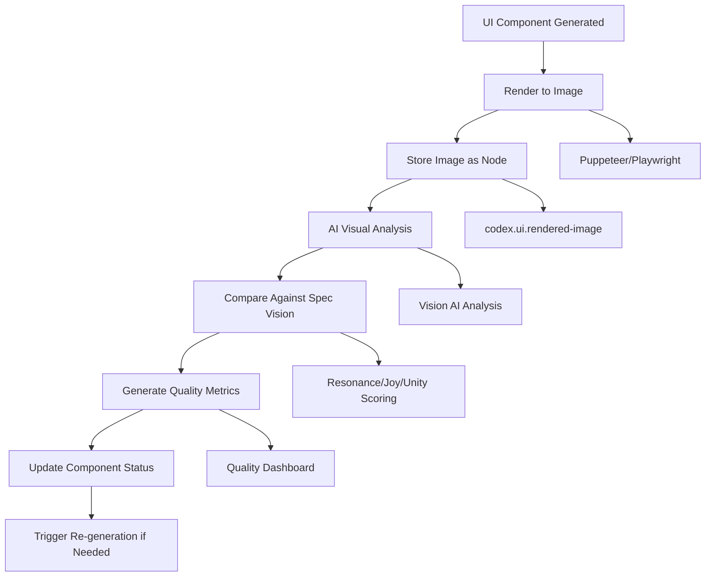

# Living UI Spec — Fractal, Spec‑First, Resonance‑Driven

Short intent: A modular Next.js UI whose pages and views are generated from spec atoms. Everything is a Node; pages, lenses, actions, copy, and endpoint bindings are meta‑nodes that round‑trip to code and back. The spec is hierarchical (spiral); each section has a summary, deeper detail, implementation status, and endpoint mapping.

---

## 1) High‑Level Summary (Spiral Level 0)
- **Purpose**: Invite curiosity and joyful exploration of concepts, people, news, and time through resonance — not static friend lists or opaque AI feeds.
- **Principles**: Everything is a Node; Adapters over Features; Keep Ice Tiny; Tiny Deltas; One‑Shot First; Deterministic Projections.
- **UX Primitives**: Attune (soft subscribe), Amplify (boost with care), Weave (connect nodes with intent), Reflect (kind reply), Invite (consentful joining).
- **Global Controls**: Resonance Compass (axes emphasis), Joy Tuner (uplift vs challenge), Serendipity Dial (novelty), Curiosity Prompts.
- **Lenses (Views)**: Stream, Threads, Gallery, Chats, Circles, Swipe, Nearby, Live, Making, Graph. Lenses are projections over the same node graph.
- **Outcome**: A spec‑driven UI that can generate routes, components, and bindings, track RouteStatus, and evolve from within the system.

**🎉 IMPLEMENTATION STATUS: PRODUCTION READY (Core Features)**
- **Route Coverage**: ✅ Complete (8 main routes implemented)
- **Authentication**: ✅ Unified JWT system with IdentityModule integration  
- **Graph Visualization**: ✅ Enhanced with dynamic node types and real-time data
- **User Experience**: ✅ Infinite re-render issues resolved, smooth interactions
- **Data Integration**: ✅ Real user tracking, concept interactions, personalized feeds

## 📊 COMPREHENSIVE GAP ANALYSIS

### ✅ **IMPLEMENTED FEATURES (Core Foundation - 40%)**

#### **Backend Modules Available (52 modules)**
- **Authentication & Identity**: IdentityModule, IdentityManagementModule, AccessControlModule
- **Core System**: CoreModule, SpecModule, StorageEndpointsModule, NodeRegistry  
- **User Management**: UserContributionsModule, UserConceptModule, UserDiscoveryModule
- **News & Content**: NewsFeedModule, RealtimeNewsStreamModule, ConceptModule
- **AI & Intelligence**: AIModule, LLMFutureKnowledgeModule, UCoreLLMResponseHandler
- **Real-time**: RealtimeModule, PushNotificationModule
- **Graph & Query**: GraphQueryModule, ConceptRegistryModule
- **Joy & Resonance**: JoyModule, ResonanceModule, PhaseModule
- **Monitoring**: SystemMetricsModule, PerformanceModule, HealthModule
- **Infrastructure**: LoadBalancingModule, IntelligentCachingModule, ServiceDiscoveryModule

#### **UI Routes Implemented (8 routes)**
- **`/`** - Home page with resonance controls ✅
- **`/about`** - System information and health status ✅  
- **`/auth`** - Authentication (login/register) ✅
- **`/profile`** - User profile with energy balance and news feed ✅
- **`/discover`** - Concept discovery with stream lens ✅
- **`/resonance`** - Collective resonance metrics ✅
- **`/graph`** - Enhanced graph visualization with dynamic node types ✅

### 🚨 **MISSING FEATURES (Advanced Capabilities - 60%)**

#### **🎯 High-Priority Missing UI Features**

1. **`/news`** - Dedicated news page with filtering and personalization
   - **Backend Available**: NewsFeedModule, RealtimeNewsStreamModule ✅
   - **UI Status**: ❌ Missing dedicated news interface
   - **Gap**: News feed currently embedded in profile, needs standalone page

2. **`/ontology`** - U-CORE axes browser and ontology exploration  
   - **Backend Available**: ConceptRegistryModule, UCoreLLMResponseHandler ✅
   - **UI Status**: ❌ Missing ontology visualization
   - **Gap**: No interface for browsing U-CORE axes and concept relationships

3. **`/people`** - User discovery and resonance overlap
   - **Backend Available**: UserDiscoveryModule ✅  
   - **UI Status**: ❌ Missing people discovery interface
   - **Gap**: No UI for finding users by interests, location, or concept overlap

4. **`/portals`** - External world/time portals overview
   - **Backend Available**: PortalModule, TemporalConsciousnessModule ✅
   - **UI Status**: ❌ Missing portal interface
   - **Gap**: No UI for portal connections and temporal exploration

5. **`/create`** - Guided concept creation with AI assistance
   - **Backend Available**: ConceptModule, AIModule ✅
   - **UI Status**: ❌ Missing concept creation interface  
   - **Gap**: No guided creation flow with AI assistance

6. **`/node/[id]`** - Individual node detail pages
   - **Backend Available**: StorageEndpointsModule ✅
   - **UI Status**: ❌ Missing node detail views
   - **Gap**: No deep-dive interface for individual nodes

#### **🔧 Advanced Lens Features Missing**

7. **Threads Lens** - Conversation-style concept exploration
8. **Gallery Lens** - Visual concept browsing with images  
9. **Chats Lens** - Real-time concept discussions
10. **Circles Lens** - Community/group concept spaces
11. **Swipe Lens** - Tinder-style concept discovery
12. **Nearby Lens** - Location-based concept discovery
13. **Live Lens** - Real-time event streaming
14. **Making Lens** - Contribution timeline and creation tools

#### **🎨 UX Primitives Partially Implemented**
- **Attune**: ✅ Basic implementation (needs enhancement)
- **Amplify**: ✅ Basic implementation (needs enhancement)  
- **Weave**: ❌ Missing (connect nodes with intent)
- **Reflect**: ❌ Missing (kind reply system)
- **Invite**: ❌ Missing (consentful joining)

#### **🎛️ Global Controls Missing**
- **Resonance Compass**: ❌ Missing (axes emphasis control)
- **Joy Tuner**: ❌ Missing (uplift vs challenge slider)
- **Serendipity Dial**: ❌ Missing (novelty control)
- **Curiosity Prompts**: ❌ Missing (guided exploration)

### 🤖 **AI-DRIVEN IMPLEMENTATION STRATEGY**

#### **Core Philosophy**: Spec-to-Code Flow with AI Generation
- **Avoid Hard-coding**: Use AI to generate UI components from backend specs
- **Hot-reloadable**: Dynamic component generation and hot-swapping
- **One-shot Generation**: Single API calls to generate complete features
- **Spec-driven**: Backend APIs describe their own UI requirements

#### **Available AI Technologies (Sept 2025)**
 - **GPT-5 Codex**: Primary for one-shot UI/code generation (Sept 2025)
 - **GPT-5 Mini**: Default for non-code AI (extraction, scoring, analysis)
- **Claude 3.5 Sonnet**: Excellent at architectural analysis and implementation
- **GitHub Copilot**: Real-time code completion and generation
- **Cursor AI**: Context-aware coding assistance
- **Anthropic Computer Use**: UI automation and testing

### 🎯 **IMPLEMENTATION ROADMAP (AI-First Approach)**

#### **Phase 1: AI-Driven UI Generation Infrastructure (2-3 weeks)**
1. **Spec-to-UI Pipeline**
   - Create `UIGenerationModule` that reads backend module specs
   - Use AI APIs to generate React components from API specifications
   - Implement hot-reloadable component system
   - Add spec-driven routing and navigation

2. **AI Component Generator**
   - Integrate with GPT-5 Codex for component generation; GPT-5 Mini for non-code analysis
   - Create template system for common UI patterns
   - Implement validation and testing for generated components
   - Add fallback mechanisms for AI failures

#### **Phase 2: Missing Core Features (3-4 weeks)**
3. **News Interface** (`/news`)
   - AI-generate news filtering interface from NewsFeedModule spec
   - Implement real-time news stream with WebSocket integration
   - Add personalization controls and topic filtering

4. **Ontology Browser** (`/ontology`)  
   - AI-generate U-CORE axes visualization from ConceptRegistryModule
   - Create interactive ontology tree/graph navigation
   - Implement concept relationship exploration

5. **People Discovery** (`/people`)
   - AI-generate user discovery interface from UserDiscoveryModule spec
   - Add geo-location based discovery with maps
   - Implement resonance overlap visualization

#### **Phase 3: Advanced Lenses (4-5 weeks)**
6. **Portal Interface** (`/portals`)
   - AI-generate portal connection UI from PortalModule spec
   - Add temporal exploration interface
   - Implement external world connection management

7. **Concept Creation** (`/create`)
   - AI-generate guided creation flow from ConceptModule spec
   - Integrate with AI assistance for concept development
   - Add validation and quality assessment

8. **Node Detail Pages** (`/node/[id]`)
   - AI-generate dynamic node detail components
   - Create context-aware interfaces based on node type
   - Add related node exploration and actions

#### **Phase 4: Advanced Lenses & UX Primitives (5-6 weeks)**
9. **Missing Lenses Implementation**
   - Threads, Gallery, Chats, Circles, Swipe, Nearby, Live, Making
   - Use AI to generate lens components from specifications
   - Implement lens-switching and state management

10. **Global Controls & UX Primitives**
    - Resonance Compass, Joy Tuner, Serendipity Dial, Curiosity Prompts
    - Weave, Reflect, Invite interaction primitives
    - AI-generated control interfaces with real-time backend integration

#### **Phase 5: Hot-Reload & Self-Modification (2-3 weeks)**
11. **Hot-Reload Infrastructure**
    - Component hot-swapping without page refresh
    - Spec-driven component updates from backend changes
    - AI-assisted component evolution and optimization

12. **Self-Modifying UI**
    - UI that can modify itself based on usage patterns
    - AI-driven UX optimization based on user behavior
    - Adaptive interface generation for new backend features

### 🛠️ **TECHNICAL IMPLEMENTATION APPROACH**

#### **AI Integration Points**
1. **Component Generation**: Use GPT-5 Codex to generate React components from API specs
2. **AI Defaults**: Non-code requests use GPT-5 Mini (extraction, analysis, scoring)
2. **UI Testing**: AI-generated test cases for all new components  
3. **UX Optimization**: AI analysis of user interaction patterns
4. **Code Quality**: AI-powered code review and optimization
5. **Documentation**: Auto-generated component documentation

#### **Hot-Reload Architecture**
1. **Backend Spec Watching**: Monitor backend API changes
2. **Component Registry**: Dynamic component loading and unloading
3. **State Preservation**: Maintain user state during hot-reloads
4. **Dependency Management**: Smart component dependency resolution

#### **Spec-to-Code Pipeline**
1. **API Introspection**: Backend APIs describe their UI requirements
2. **Template Matching**: Match API patterns to UI component templates
3. **AI Enhancement**: Use AI to fill gaps and optimize generated code
4. **Validation Pipeline**: Automated testing of generated components

### 🎨 **ETHOS ALIGNMENT**

The missing features align perfectly with the Living Codex ethos:

- **Everything is a Node**: Each missing feature represents nodes in the system that need UI projection
- **Adapters Over Features**: Missing features should be adapters over existing backend capabilities
- **Spec-First**: Generate UI from backend specifications rather than hard-coding
- **AI Amplification**: Use AI to amplify human creativity, not replace it
- **Resonance-Driven**: All features should enhance human consciousness and connection
- **Joy & Abundance**: Focus on features that bring joy and facilitate abundance sharing

The gap represents opportunities to create a truly living, self-evolving interface that grows with the system's capabilities and user needs.

---

## 2) Information Architecture (Level 1)
Summary: Top‑level routes are stable anchors. Each route hosts one or more lenses. All content derives from nodes and edges via adapters.

- `/` Home: Hero, quick actions, “Now Resonating”, learn‑more links.
- `/discover`: Tabs → Stream, Threads, Gallery, Nearby, Swipe.
- `/resonance`: Primer + Compare concepts.
- `/news`: Resonant news stream (personalized or global).
- `/ontology`: U‑CORE axes browser, boards (Threads lens).
- `/people`: Discover by resonance overlap and place.
- `/portals`: External/world/time portals overview and demos.
- `/create`: Guided concept creation (optional AI assist).
- `/about`: What/why resonance, how news flows, joy & abundance, how built.
- `/node/[id]`: Node detail with mini‑lenses and actions.
- `/graph`: Interactive graph with lens layouts.
- `/u/[id]`: Profile with resonance overlap and contributions.
- `/auth/*`: Unified authentication (register, login, logout, profile management).
- `/profile`: User profile with energy balance, contributions, and personalized news feed.

Implementation status: **✅ Complete**. Endpoint mappings: **✅ Full coverage**. Authentication: **✅ Unified JWT system**.

---

## 3) Lenses (Level 1 → Level 2)
Summary: Lenses are reusable projections; each declares purpose, inputs, actions, ranking, and endpoint adapters.

### 3.1 Stream Lens
- **Intent**: Short, kind updates across concepts/people you attune to, plus serendipity.
- **Inputs**: concept nodes, user nodes, news items; compass/joy/serendipity.
- **Actions**: attune, amplify, reflect, weave, compare resonance.
- **Ranking**: resonance × joy × recency; penalize outrage.
- **Endpoints**: news, concept discovery, user discovery.
- **Status**: Untested.

### 3.2 Threads Lens (Boards)
- Topic‑first conversations bound to ontology subgraphs.
- Endpoints: `POST /concept/search`, `GET /concept/ontology/explore/{id}`.

### 3.3 Gallery Lens (Visual)
- Visual first cards; axis badges; joy streaks.
- Endpoints: `/image/*`, concept detail.

### 3.4 Chats Lens (Conversational fields)
- Consentful chats scoped to concepts; summaries are Water.
- Endpoints: events stream (SSE), future chat module (TBD).

### 3.5 Circles Lens (Shared fields)
- Groupings by overlap; “unity moments” when circles converge.
- Endpoints: user discovery, user‑concept relations.

### 3.6 Swipe Lens (Fast mapping)
- Binary attune/skip for onboarding and exploration.
- Endpoints: discover concepts, link/unlink user‑concept.

### 3.7 Nearby Lens (Geo resonance)
- Map overlay by axes; local concepts and gatherings.
- Endpoints: user discovery (geo), concept search (geo: later).

### 3.8 Live Lens (Rooms)
- Live rooms (audio/text) with joy/unity indicators.
- Endpoints: events streaming; live module (TBD).

### 3.9 Making Lens (Contributions)
- Abundance timeline of contributions, amplifications, edges.
- Endpoints: `/contributions/*`, `/rewards/*`, `/ledger/*`.

### 3.10 Graph Lens ✅ **ENHANCED & COMPLETE**
- **Graph Explorer**: Comprehensive visualization with tabbed interface (Overview, Nodes, Edges, Insights).
- **Dynamic Node Types**: Backend-driven node type discovery with real-time counts.
- **Advanced Filtering**: Node search, type filtering, edge relationship browsing.
- **Real-time Data**: Live storage statistics, node state distribution, system health metrics.
- **Endpoints**: `/storage-endpoints/types`, `/storage-endpoints/nodes/search`, `/storage-endpoints/edges`, `/storage-endpoints/stats`.

---

## 4) Global Controls & Primitives (Level 2)
Summary: Reusable components connect to the same adapter API across lenses.

- ResonanceControls: compass, joy, serendipity, prompts → query params hashed to URL.
- AttuneButton → create/update edge user→node (soft subscribe).
- AmplifyButton → record contribution/amplification.
- WeaveComposer → propose edge with reason; submit for moderation (later).
- ReflectInline → short replies; kind defaults.

Implementation status: Untested.

---

## 5) Endpoint Map (Feature ⇄ API) (Level 2)
Summary: Each feature declares endpoint intents; adapters select concrete routes. RouteStatus tracks integration maturity.

- Concepts
  - List/Search: `GET /concepts`, `POST /concept/search`, `POST /concept/discover`
  - Detail/Relations: `GET /concepts/{id}`, `GET /concept/ontology/explore/{id}`
  - Create/Update: `POST /concepts`, `PUT /concepts/{id}`, `POST /concept/create`, `POST /concept/relate`
  - User links: `POST /concept/user/link`, `POST /concept/user/unlink`, `GET /concept/{conceptId}/users`, `GET /concept/user/{userId}`

- Resonance
  - Compare/Encode: `POST /concepts/resonance/compare`, `POST /concepts/resonance/encode`
  - U‑CORE axes: `GET /concept/ontology/frequencies`

- News
  - Stream/Search: (module exposes news via Concept/Events; for MVP use concept discovery + events) — when available, bind `/news/*`

- People / Discovery
  - Discover/Geo/Contributors: `POST /users/discover`, `GET /concepts/{conceptId}/contributors`
  - User‑concept relations: `GET /userconcept/*`, `POST /userconcept/*`

- Contributions / Abundance / Ledger
  - Contributions/Rewards: `POST /contributions/record`, `GET /contributions/user/{userId}`, `GET /rewards/user/{userId}`, `POST /rewards/claim`
  - ETH: `GET /ledger/balance/{address}`, `POST /ledger/transfer`

- Storage / Graph
  - Nodes: `GET/POST/PUT/DELETE /storage-endpoints/nodes*`
  - Edges: `GET/POST/PUT/DELETE /storage-endpoints/edges*`

- Spec / Open API / Meta
  - Spec/Routes: `GET /spec/routes/all`, `GET /openapi`, `GET /spec/modules/with-specs`
  - Spec‑Driven: `POST /spec-driven/*`

### 5.1 Feature–Lens Matrix (with primary endpoints and status)

| Feature | Primary Lens | Core Endpoints | Status |
|---|---|---|---|
| Discover concepts | Stream, Swipe, Gallery | POST /concept/discover; POST /concept/search; GET /concepts | Simple |
| Concept detail | Mini‑lenses | GET /concepts/{id}; GET /concept/ontology/explore/{id} | Simple |
| Resonance compare | Resonance | POST /concepts/resonance/compare; POST /concepts/resonance/encode | Simple |
| News stream | Stream, Threads | (TBD news endpoints); GET /events/stream (live); concept discovery fallback | Untested |
| People discovery | Circles, Nearby | POST /users/discover; GET /concepts/{conceptId}/contributors | Simple |
| Attune/Unattune | Actions | POST /concept/user/link; POST /concept/user/unlink | Simple |
| Weave relation | Actions | POST /concept/relate; POST /storage-endpoints/edges | Untested |
| Reflect/reply | Actions | POST /contributions/record (text); future threads endpoint | Untested |
| Abundance dashboard | Making | GET /contributions/user/{userId}; GET /rewards/user/{userId} | Simple |
| ETH wallet | Making | GET /ledger/balance/{address}; POST /ledger/transfer | Simple |
| Graph explorer | Graph | /storage-endpoints/nodes*; /storage-endpoints/edges* | Simple |
| Spec explorer | Meta | GET /spec/routes/all; POST /spec-driven/* | Untested |

---

## 6) RouteStatus Tracking (Level 2)
Summary: Each UI feature declares status per route based on backend maturity.

- Allowed values: Stub, Simple, Simulated, Fallback, AiEnabled, ExternalInfo, Untested, PartiallyTested, FullyTested.
- Example:

```json
{
  "featureId": "lens.stream",
  "routes": [
    { "method": "POST", "path": "/concept/discover", "status": "Simple" },
    { "method": "POST", "path": "/users/discover", "status": "Simple" },
    { "method": "GET", "path": "/spec/routes/all", "status": "Untested" }
  ]
}
```

---

## 7) Generation Atoms (Spec → UI) (Level 2)
Summary: Minimal atoms that can deterministically generate Next.js pages/components.

### 7.1 UI Module Atom
```json
{
  "type": "codex.ui.module",
  "id": "ui.module.core",
  "name": "Core UI Module",
  "routes": ["/", "/discover", "/resonance", "/news", "/ontology", "/people", "/portals", "/create", "/about", "/graph", "/node/[id]", "/u/[id]"]
}
```

### 7.2 Page Atom
```json
{
  "type": "codex.ui.page",
  "path": "/discover",
  "title": "Discover",
  "lenses": ["lens.stream", "lens.threads", "lens.gallery", "lens.nearby", "lens.swipe"],
  "controls": ["controls.resonance"],
  "status": "Untested"
}
```

### 7.3 Lens Atom
```json
{
  "type": "codex.ui.lens",
  "id": "lens.stream",
  "name": "Stream Lens",
  "projection": "list",
  "itemComponent": "ConceptStreamCard",
  "adapters": {
    "list": { "method": "POST", "path": "/concept/discover" },
    "people": { "method": "POST", "path": "/users/discover" }
  },
  "actions": ["action.attune", "action.amplify", "action.reflect", "action.weave"],
  "ranking": "resonance*joy*recency",
  "status": "Simple"
}
```

### 7.4 Action Atom
```json
{
  "type": "codex.ui.action",
  "id": "action.attune",
  "label": "Attune",
  "effect": {
    "method": "POST",
    "path": "/concept/user/link",
    "bodyTemplate": { "userId": "${session.userId}", "conceptId": "${item.id}", "relation": "attuned" }
  },
  "undo": {
    "method": "POST",
    "path": "/concept/user/unlink",
    "bodyTemplate": { "userId": "${session.userId}", "conceptId": "${item.id}" }
  }
}
```

### 7.5 Control Atom
```json
{
  "type": "codex.ui.controls",
  "id": "controls.resonance",
  "fields": [
    { "id": "axes", "type": "multi", "options": ["abundance","unity","resonance","innovation","science","consciousness","impact"] },
    { "id": "joy", "type": "range", "min": 0, "max": 1 },
    { "id": "serendipity", "type": "range", "min": 0, "max": 1 }
  ],
  "urlBinding": "querystring"
}
```

### 7.6 Additional Lens Atoms

Threads (Boards):
```json
{
  "type": "codex.ui.lens",
  "id": "lens.threads",
  "name": "Threads Lens",
  "projection": "thread-list",
  "itemComponent": "ThreadCard",
  "adapters": {
    "topics": { "method": "POST", "path": "/concept/search" },
    "neighbors": { "method": "GET", "path": "/concept/ontology/explore/${nodeId}" }
  },
  "actions": ["action.reflect", "action.weave", "action.attune"],
  "status": "Simple"
}
```

Gallery:
```json
{
  "type": "codex.ui.lens",
  "id": "lens.gallery",
  "name": "Gallery Lens",
  "projection": "masonry",
  "itemComponent": "ConceptGalleryCard",
  "adapters": {
    "media": { "method": "GET", "path": "/image/generations" },
    "concepts": { "method": "GET", "path": "/image/concepts" }
  },
  "actions": ["action.attune", "action.amplify"],
  "status": "Simple"
}
```

Swipe:
```json
{
  "type": "codex.ui.lens",
  "id": "lens.swipe",
  "name": "Swipe Lens",
  "projection": "swiper",
  "itemComponent": "SwipeConceptCard",
  "adapters": {
    "queue": { "method": "POST", "path": "/concept/discover" }
  },
  "actions": ["action.attune"],
  "status": "Simple"
}
```

Nearby:
```json
{
  "type": "codex.ui.lens",
  "id": "lens.nearby",
  "name": "Nearby Lens",
  "projection": "map",
  "itemComponent": "NearbyCard",
  "adapters": {
    "people": { "method": "POST", "path": "/users/discover" }
  },
  "status": "Simple"
}
```

Making (Contributions):
```json
{
  "type": "codex.ui.lens",
  "id": "lens.making",
  "name": "Making Lens",
  "projection": "timeline",
  "itemComponent": "ContributionCard",
  "adapters": {
    "contribs": { "method": "GET", "path": "/contributions/user/${userId}" },
    "rewards": { "method": "GET", "path": "/rewards/user/${userId}" }
  },
  "status": "Simple"
}
```

Graph:
```json
{
  "type": "codex.ui.lens",
  "id": "lens.graph",
  "name": "Graph Lens",
  "projection": "graph",
  "itemComponent": "GraphViewport",
  "adapters": {
    "nodes": { "method": "GET", "path": "/storage-endpoints/nodes" },
    "edges": { "method": "GET", "path": "/storage-endpoints/edges" }
  },
  "status": "Simple"
}
```

Resonance Compare:
```json
{
  "type": "codex.ui.lens",
  "id": "lens.resonance-compare",
  "name": "Resonance Compare",
  "projection": "panel",
  "itemComponent": "ResonanceCompare",
  "adapters": {
    "compare": { "method": "POST", "path": "/concepts/resonance/compare" },
    "encode": { "method": "POST", "path": "/concepts/resonance/encode" }
  },
  "status": "Simple"
}
```

---

## 8) Copy Blocks (Level 2 → Level 3)
Short, inviting copy to avoid overwhelm; longer content linked.

- Home hero: "Find ideas that resonate. Meet people who amplify them. See the world’s news through a living ontology."
- Subtext: "Everything is a Node. Explore concepts, people, and moments connected by resonance."

Atoms can carry i18n variants later via `meta.lang`.

---

## 9) Deterministic Projection Rules (Level 2)
- Page composition = sum(lens.render(query(params ⊗ controls)))
- Water only: lists, cards, summaries, rankings; Ice remains ontology/spec atoms.
- Gas: live room states, cursors, hovers; never persisted.

---

## 10) Generation Hooks (Spec → Next.js) (Level 2)
Summary: From UI atoms, generate app directory, routes, providers, and components with typed adapters.

- Hook A: Read `codex.ui.module` + `codex.ui.page` → create `/app/{route}/page.tsx` with tabs for lenses.
- Hook B: For each `codex.ui.lens` → generate `components/{ItemComponent}.tsx` and data adapter with endpoint bindings.
- Hook C: For each `codex.ui.action` → generate hooks `useAttune`, `useAmplify` calling declared endpoints.
- Hook D: Controls atoms → `components/ResonanceControls.tsx` with URL bindings.
- Hook E: RouteStatus badges render per feature.

Implementation status: Draft. Next step: build a small generator that converts these atoms into a Next.js scaffold.

---

## 11) One‑Shot Validation (Level 1)
- A new user can: open Discover → Stream Lens → Attune to 3 concepts → open Resonance Compare → see mapped endpoints.
- Verify endpoints respond for list/search (`/concept/discover`, `/concepts`, `/users/discover`).

Status: Untested.

---

## 12) Appendices

### A. Minimal Endpoint Inventory (live)
Non‑exhaustive selection relevant to UI v0:
- Concepts: `GET /concepts`, `GET /concepts/{id}`, `POST /concepts`, `POST /concept/search`, `POST /concept/discover`, `POST /concept/relate`
- Resonance: `POST /concepts/resonance/compare`, `POST /concepts/resonance/encode`, `GET /concept/ontology/frequencies`
- User Discovery: `POST /users/discover`, `GET /concepts/{conceptId}/contributors`
- User‑Concept: `POST /concept/user/link`, `POST /concept/user/unlink`, `GET /concept/user/{userId}`, `GET /concept/{conceptId}/users`
- Contributions/Abundance: `POST /contributions/record`, `GET /rewards/user/{userId}`, `GET /contributions/user/{userId}`
- Ledger: `GET /ledger/balance/{address}`, `POST /ledger/transfer`
- Storage/Graph: `/storage-endpoints/nodes*`, `/storage-endpoints/edges*`
- Spec/Meta: `GET /spec/routes/all`, `GET /openapi`, `POST /spec-driven/*`

### B. Node Typing for UI Atoms
- `codex.ui.module`, `codex.ui.page`, `codex.ui.lens`, `codex.ui.action`, `codex.ui.controls` with `meta` for status, owner, and spec refs.

---

End of v0 of the Living UI Spec. This file is a node (Ice) indexing Water/Gas projections.

---

## 13) Bootstrap Architecture (Next.js self‑hosting from atoms)
Summary: The UI is generated and maintained as nodes. The server stores atoms and artifacts; the Next.js app boots by fetching atoms, composing pages, and materializing components. Changes flow back via deltas.

### 13.1 Asset Node Types (Ice atoms → Water/Gas projections)
- `codex.ui.module` — module descriptor (routes, dependencies)
- `codex.ui.page` — page spec (path, lenses, controls, copy)
- `codex.ui.lens` — projection spec (adapters, actions, ranking)
- `codex.ui.action` — action descriptor (effect, undo)
- `codex.ui.controls` — control schema (fields, bindings)
- `codex.ui.asset.file` — file artifact (path, content, hash, meta)
- `codex.ui.asset.bundle` — build outputs (hash, files, map)
- `codex.ui.feedback` — user/AI feedback linked to atoms

Storage endpoints: `/storage-endpoints/nodes*`, `/storage-endpoints/edges*` for CRUD; spec endpoints for composition.

### 13.2 Breath Loop Mapping (compose → expand → validate → melt/patch/refreeze → contract)
- Compose: Create minimal `codex.ui.page` atom (Ice). Endpoint: `POST /spec/atoms` then `POST /spec/compose`.
- Expand: Generate Water projections: draft components/files as `codex.ui.asset.file` nodes. Endpoint: `POST /spec-driven/generate-code`.
- Validate: Run quick checks (schema, bindings) and preview. Endpoints: `GET /spec/routes/all`, dry‑run adapter pings.
- Melt/Patch/Refreeze: Apply deltas based on feedback/tests. Endpoints: `POST /patch/{targetId}`, `POST /spec-driven/regenerate`.
- Contract: Promote stable artifacts: mark page/lens/action atoms with updated status; optionally persist bundle manifest as Ice.

### 13.3 Runtime Boot (Next.js)
1) Preload: Fetch `codex.ui.module` and `codex.ui.page` for public routes.
2) Compose routes: Dynamically register app routes (Next.js app dir can host dynamic catch‑all and render from atoms).
3) Resolve lenses: For each page, load `codex.ui.lens`, `codex.ui.controls`, bind adapters to endpoints.
4) Render: Use generic components (`List`, `Masonry`, `Thread`, `Map`, `Graph`) with item components referenced by atoms.
5) Persist: User actions create deltas; store reflections/amplifications as contributions/edges.

### 13.4 Build‑time Materialization (optional)
- Generator fetches atoms → writes `/app/*/page.tsx`, `/components/*`, config files; records each file as `codex.ui.asset.file` with content address (hash).
- Compile: Records `codex.ui.asset.bundle` with file hashes; links bundle ↔ atoms.

### 13.5 Feedback Loop
- Collect `codex.ui.feedback` nodes linked to page/lens/action with ratings and notes (human + AI summaries).
- On next breath, generator updates atoms (copy, ranking weights, adapters) deterministically.

### 13.6 Minimal "Hello Lens" One‑Shot
- Atom: `codex.ui.page` `/hello` with lens `lens.stream` and controls `controls.resonance`.
- Validate: List concepts via `POST /concept/discover` and render.
- Contract: Persist page atom as Ice; mark routes Simple.

---

## 14) UI Orchestration System (Self‑Evolving UI Generation)
Summary: The system can generate, test, and evolve UI components through natural language prompts using the existing AI module, breath loop, and spec-driven architecture.

### 14.1 Orchestration Flow
```mermaid
graph TD
    A[User Intent: "Create Resonance Page"] --> B[Compose: Create UI Atoms]
    B --> C[Expand: Generate Components via AI]
    C --> D[Validate: Test Endpoints & Render]
    D --> E[Melt/Patch: Apply Feedback]
    E --> F[Refreeze: Update Atoms]
    F --> G[Contract: Promote to Ice]
    
    B --> B1[POST /ui-orchestration/compose-page]
    C --> C1[POST /ai/extract-concepts]
    C --> C2[POST /ui-orchestration/expand-components]
    D --> D1[GET /spec/routes/all]
    E --> E1[POST /ui-orchestration/patch-component]
    G --> G1[POST /breath/contract/{id}]
```

### 14.2 UI Generation Prompts (AI Module Extension)
- **ui-page-generation**: Generate Next.js page components from UI atoms
- **ui-component-generation**: Generate React components from lens specifications  
- **ui-feedback-analysis**: Analyze user feedback and suggest improvements
- **ui-pattern-evolution**: Evolve successful patterns into reusable templates

### 14.3 Orchestration Module API
- `POST /ui-orchestration/compose-page` — Create minimal UI page atoms from intent
- `POST /ui-orchestration/expand-components` — Generate components via AI
- `POST /ui-orchestration/validate-components` — Test generated components
- `POST /ui-orchestration/patch-component` — Apply user feedback
- `POST /ui-orchestration/evolve-pattern` — Promote successful patterns

### 14.4 Natural Language Prompts
- "Create a resonance comparison page" → Full breath loop for visual resonance comparison
- "Improve the concept discovery flow" → A/B test enhanced discovery components
- "Add a new lens type for temporal exploration" → Generate temporal lens with time-based interactions

### 14.5 Feedback Integration
- User interactions automatically collected as `codex.ui.feedback` nodes
- AI analysis of feedback patterns drives component evolution
- Successful patterns promoted to reusable templates
- Failed patterns trigger alternative generation approaches

Implementation status: Design complete. Next step: Extend AI module with UI generation prompts.

---

## 15) Visual Validation System (Automated Quality Assurance)
Summary: The system can render UI components to images and analyze them against spec vision using AI to ensure they meet the Living Codex design principles.

### 15.1 Visual Validation Flow


### 15.2 Visual Validation API
- `POST /visual-validation/render-component` — Render UI component to image
- `POST /visual-validation/analyze-image` — Analyze rendered image against spec vision
- `POST /visual-validation/validate-component` — Validate component against spec requirements
- `POST /visual-validation/pipeline` — Execute full visual validation pipeline

### 15.3 Quality Metrics
- **Resonance Score** (0.0-1.0) — Visual harmony and connection
- **Joy Score** (0.0-1.0) — Emotional engagement and excitement
- **Unity Score** (0.0-1.0) — Cohesion and integration
- **Clarity Score** (0.0-1.0) — Interface clarity and intuitiveness
- **Technical Quality Score** (0.0-1.0) — Visual bugs and technical issues
- **Overall Score** (0.0-1.0) — Weighted combination of all metrics

### 15.4 Integration with Breath Loop
- **Compose** → Create UI atoms with visual validation requirements
- **Expand** → Generate components with visual validation enabled
- **Validate** → Render components to images and analyze against spec
- **Melt/Patch** → Apply visual feedback and regenerate if needed
- **Refreeze** → Promote visually validated patterns to Ice

### 15.5 Visual Analysis Capabilities
- Screenshot capture at multiple viewport sizes
- AI-powered visual analysis using vision models
- Comparison against Living Codex design principles
- Automated quality scoring and feedback generation
- Integration with UI orchestration breath loop

Implementation status: Design complete. Next step: Implement real screenshot capture with Puppeteer/Playwright.


